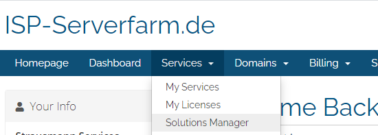

# Installation

## Requirements

Der ISP Solutions Manager hat folgende Systemanforderungen:

* iocube loader:
  * 10.4.0+
* PHP:
  * 7.2+
* PHP Extentions:
  * curl
  * json
* PHP Settings:
  * max\_execution\_time 300
  * memory\_limit min. 256MB
* Composer:
  * v2.0.6+

## Download

Der ISP Solutions Manager steht nach dem Kauf einer unserer WHMCS Addons im [Kundencenter ](https://kundencenter.isp-serverfarm.de/solutionsmanager.php)für Download zur Verfügung.

Bei dem ersten Aufruf der Seite wird ein API Key generiert, der ab diesem Zeitpunkt ein Jahr lang gültig ist.  
Notieren Sie sich den Key, der wird für die spätere Installation des ISP Solutions Managers im WHMCS benötigt.

## Installation

### Upload

Entpacken Sie die ispserverfarm-updater\_latest.zip und laden Sie den Inhalt direkt in das Root Verzeichnis von WHMCS hoch. Der Inhalt der Zip enthält bereits die erforderliche Verzeichnisstruktur für die korrekte Platzierung im WHMCS

### Konfiguration

